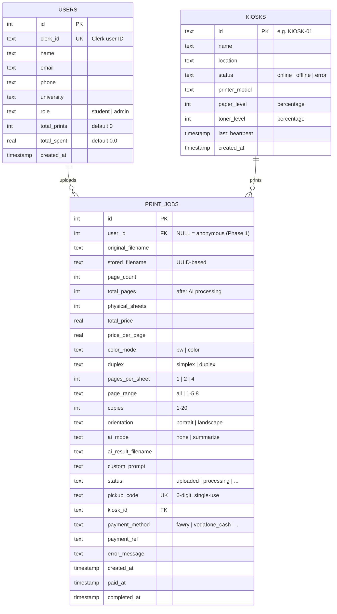

# PrintStation — Entity Relationship Diagram (ERD)

> Visual database schema showing all tables, their fields, and relationships.

---

## Full ERD



---

## Relationships

| Relationship | Cardinality | Description |
|---|---|---|
| Users → Print Jobs | One-to-Many | One user can have many print jobs |
| Kiosks → Print Jobs | One-to-Many | One kiosk handles many print jobs |

---

## Phase 2+ Tables (Planned)

```mermaid
erDiagram
    USERS ||--o{ PRINT_JOBS : "uploads"
    USERS ||--o{ PAYMENTS : "pays"
    USERS ||--o| WALLETS : "has"
    PRINT_JOBS ||--|| PAYMENTS : "paid by"
    KIOSKS ||--o{ PRINT_JOBS : "prints"
    KIOSKS ||--o{ KIOSK_EVENTS : "logs"
    LOCATIONS ||--o{ KIOSKS : "contains"

    PAYMENTS {
        int id PK
        int job_id FK
        int user_id FK
        real amount
        text method "fawry | vodafone_cash | instapay | card"
        text provider_ref "Paymob transaction ID"
        text status "pending | completed | failed | refunded"
        timestamp created_at
        timestamp completed_at
    }

    WALLETS {
        int id PK
        int user_id FK UK
        real balance "pre-loaded credit"
        timestamp updated_at
    }

    LOCATIONS {
        int id PK
        text name "Cairo University - Main Library"
        text type "university | government | commercial"
        text address
        text city
        text contact_person
        text contact_phone
        timestamp created_at
    }

    KIOSK_EVENTS {
        int id PK
        text kiosk_id FK
        text event_type "online | offline | error | paper_low | toner_low"
        text details
        timestamp created_at
    }
```

---

## Notes

- **Phase 1**: Only `print_jobs` and `kiosks` tables are active. `users` table exists but `user_id` is nullable (anonymous uploads).
- **Phase 2**: `users` populated via Clerk webhook. `payments` table tracks Paymob transactions separately. `locations` enables multi-site management.
- **Phase 3**: `wallets` for pre-loaded credit. `kiosk_events` for operational monitoring and analytics.
