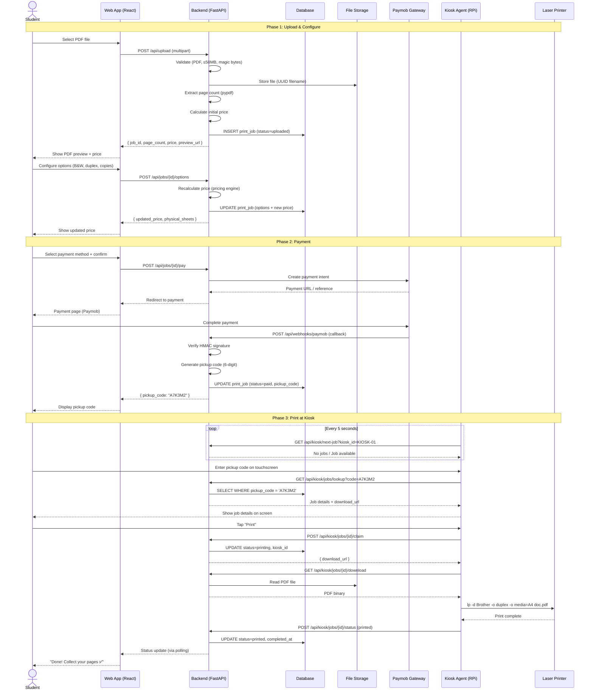
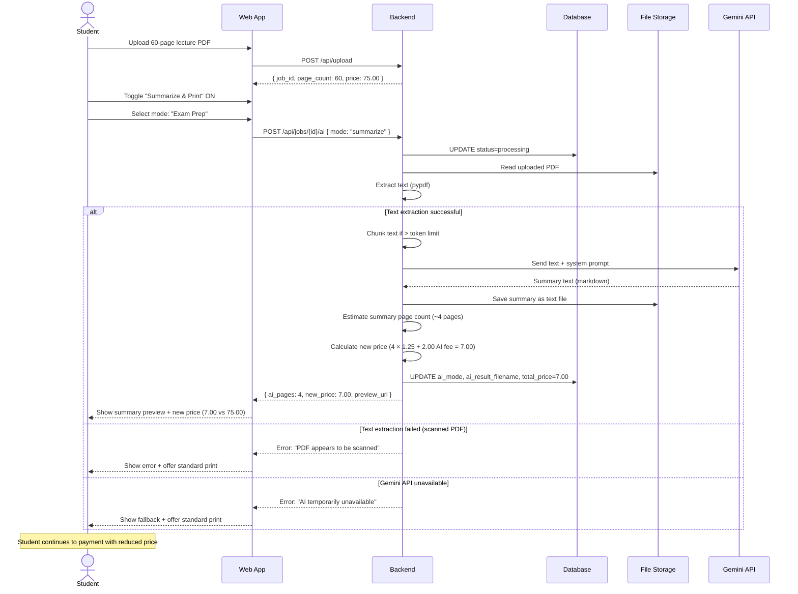
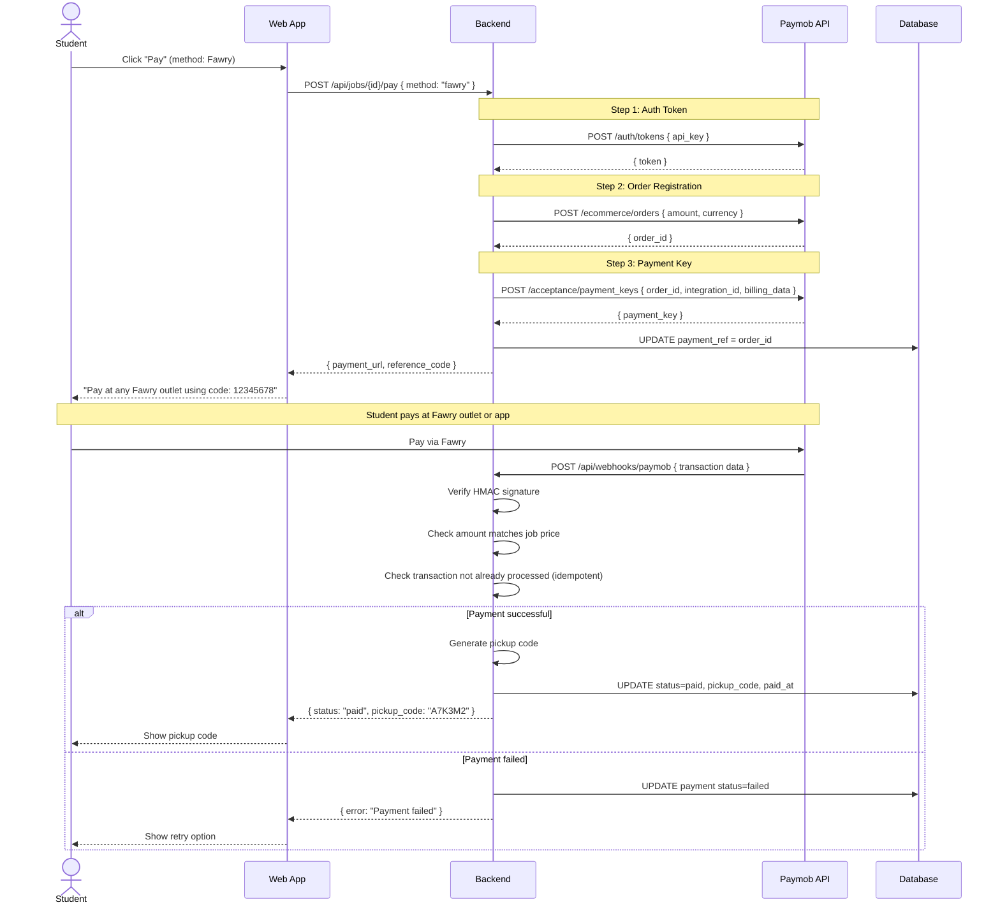
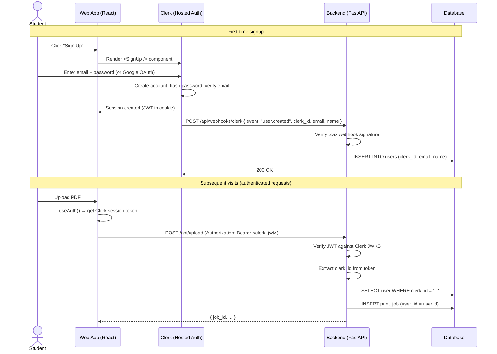
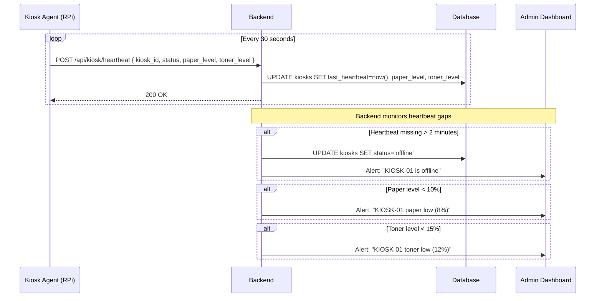

# PrintStation — Sequence Diagrams

> Step-by-step service-to-service communication flows for critical operations.

---

## 1. Standard Print Flow (Upload → Pay → Print)

The primary end-to-end flow — a student uploads a PDF, pays, and collects the printout.

---

## 2. AI Summarize & Print Flow

Student uses AI to condense a long document before printing.

---

## 3. Paymob Payment Flow (Detailed)

Technical detail of the Paymob integration.

---

## 4. Clerk Authentication Flow (Phase 2)

How Clerk integrates with the frontend and backend.

---

## 5. Kiosk Heartbeat & Health Monitoring

How kiosks report their health status to the backend.

