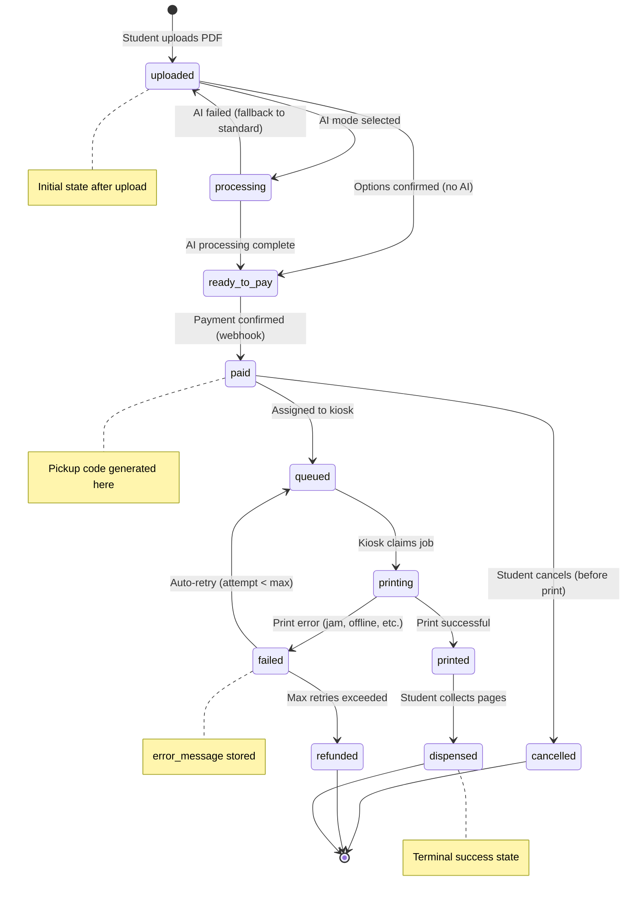
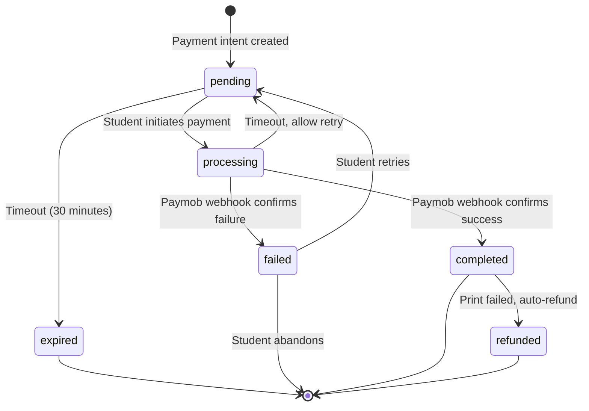
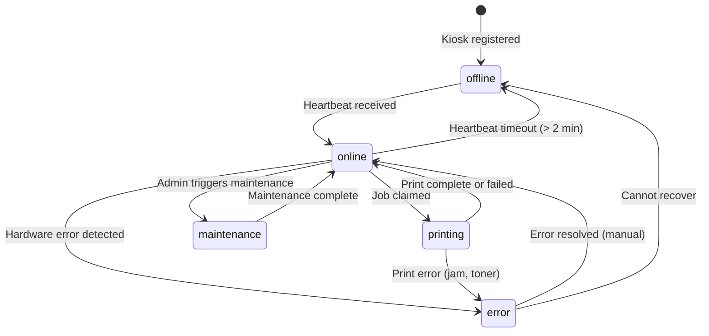
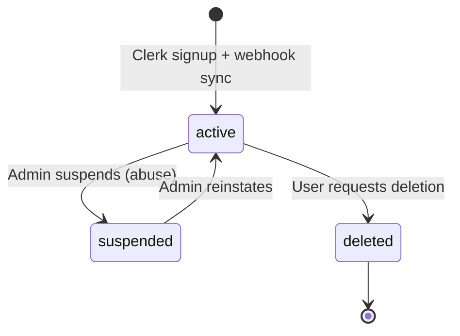

# PrintStation — State Machine Diagrams

> Valid state transitions for stateful entities in the system.

---

## 1. Print Job Lifecycle

The core state machine — every print job follows this lifecycle.

### State Descriptions

| State | Description | Next Valid States |
|---|---|---|
| `uploaded` | PDF received and stored, awaiting configuration | `processing`, `ready_to_pay` |
| `processing` | AI summarization or file conversion in progress | `ready_to_pay`, `uploaded` (fallback) |
| `ready_to_pay` | Options confirmed, price calculated, awaiting payment | `paid` |
| `paid` | Payment confirmed, pickup code issued, awaiting kiosk | `queued`, `cancelled` |
| `queued` | Job assigned to a specific kiosk, waiting for claim | `printing` |
| `printing` | Kiosk is actively printing the document | `printed`, `failed` |
| `printed` | Print completed successfully | `dispensed` |
| `dispensed` | Student has collected the printed pages | _(terminal)_ |
| `failed` | Print failed (paper jam, toner, offline) | `queued` (retry), `refunded` |
| `cancelled` | Job cancelled by student or system | _(terminal)_ |
| `refunded` | Payment refunded after unrecoverable failure | _(terminal)_ |

### Key Timestamps

| Timestamp | Set When |
|---|---|
| `created_at` | Job created (`uploaded`) |
| `paid_at` | Payment confirmed (`paid`) |
| `completed_at` | Print finished (`printed`) |

---

## 2. Payment State Machine

### Payment States

| State | Description |
|---|---|
| `pending` | Payment intent created, waiting for student action |
| `processing` | Student initiated payment, waiting for gateway confirmation |
| `completed` | Payment confirmed by Paymob webhook |
| `failed` | Payment rejected or errored |
| `expired` | Payment not completed within timeout window |
| `refunded` | Money returned to student after print failure |

---

## 3. Kiosk Status Machine

### Kiosk States

| State | Description | Accepts Jobs? |
|---|---|---|
| `offline` | No heartbeat received, kiosk unreachable | ❌ |
| `online` | Heartbeat active, ready to accept jobs | ✅ |
| `printing` | Currently printing a job | ❌ (busy) |
| `error` | Hardware error (jam, toner, paper) | ❌ |
| `maintenance` | Admin-initiated maintenance mode | ❌ |

---

## 4. User Account States (Phase 2)

---

## Transition Rules

### Who Can Trigger Each Transition?

| Transition | Triggered By |
|---|---|
| `uploaded → processing` | Backend (when AI mode selected) |
| `uploaded → ready_to_pay` | Backend (when options confirmed) |
| `ready_to_pay → paid` | Paymob webhook (payment confirmed) |
| `paid → queued` | Backend (auto-assign to kiosk) |
| `queued → printing` | Kiosk agent (claims job) |
| `printing → printed` | Kiosk agent (reports success) |
| `printing → failed` | Kiosk agent (reports failure) |
| `failed → queued` | Backend (auto-retry logic) |
| `failed → refunded` | Backend (max retries exceeded) |
| `printed → dispensed` | Kiosk agent (student collects) or auto after timeout |
| `paid → cancelled` | Student (via web app) or admin |
